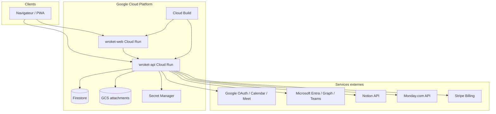

# Wroket — Architecture technique

**Document préparé pour dépôt e-Soleau INPI**  
**Version :** 2026-06-15

---

## 1. Vue d'ensemble



---

## 2. Production (Cloud Run)

| Composant | Service | URL |
|-----------|---------|-----|
| Frontend | `wroket-web` | https://wroket.com |
| Backend API | `wroket-api` | https://api.wroket.com |
| Projet GCP | `involuted-reach-490718-h4` | Région `europe-west1` |
| Compte de service | `wroket-run@…iam.gserviceaccount.com` | Accès Firestore + secrets |

**Important :** la VM GCP (`wroket-vm`) est un environnement secondaire de test, **pas** la production.

---

## 3. Structure du dépôt source

```
Wroket/
├── frontend/          # Next.js 15 — UI, pages, composants, i18n
│   └── src/
│       ├── app/       # Routes App Router (dashboard, projets, agenda, docs…)
│       ├── components/
│       └── lib/       # Client API, hooks, utilitaires
├── backend/           # Express — API REST
│   └── src/
│       ├── routes/        # Points d'entrée HTTP
│       ├── controllers/   # Validation requêtes
│       ├── services/      # Logique métier + Firestore
│       └── persistence.ts # Cache mémoire + flush Firestore
├── cloudbuild.yaml    # Pipeline build + deploy Cloud Run
├── docs/              # Documentation technique et runbooks
└── e2e/               # Tests Playwright
```

---

## 4. Backend — pattern routes → controllers → services

| Domaine | Routes | Persistance |
|---------|--------|-------------|
| Auth / users | `/auth/*` | Firestore `store/users` |
| Tâches | `/todos/*` | Collection `todos_v2` (mode v2 prod) |
| Projets | `/projects/*` | Firestore `store/projects` |
| Équipes | `/teams/*` | Firestore `store/teams` |
| Notes | `/notes/*` | Firestore `store/notes` |
| Calendrier | `/calendar/*` | Tokens OAuth chiffrés, slots |
| Intégrations | `/integrations/*` | Connexions OAuth Notion/Monday |
| Billing | `/billing/*` | Stripe webhooks → user billing fields |
| Health | `/health/ready` | Drift monitor, flush status |

---

## 5. Persistance et cohérence multi-replica

Cloud Run peut exécuter jusqu'à **2 instances** simultanées.

| Mécanisme | Rôle |
|-----------|------|
| `initStore()` | Hydratation cache mémoire depuis Firestore au démarrage |
| `hydrateTodosFromV2IfNeeded()` | Chargement tâches depuis `todos_v2` |
| `attachLiveInvalidation()` | Listeners Firestore `onSnapshot` — sync cross-replica |
| `todosDriftMonitor` | Contrôle horaire mémoire ↔ Firestore, alertes |
| Debounce flush 500 ms + watchdog 5 s | Écritures batch vers Firestore |

Mode production : **`TODOS_STORAGE_MODE=v2`** (une tâche = un document Firestore).

---

## 6. Frontend — pages principales

| Route | Fonction |
|-------|----------|
| `/dashboard` | Tableau de bord |
| `/todos` | Gestion des tâches |
| `/agenda` | Calendrier et créneaux |
| `/projects` | Projets PMO (Kanban, Gantt, steering) |
| `/teams` | Équipes et portfolio |
| `/notes` | Bloc-notes |
| `/settings` | Paramètres, intégrations, abonnement |
| `/docs` | Documentation intégrations (public) |
| `/pricing` | Tarification |

---

## 7. Sécurité

- Cookies session sécurisés (`COOKIE_SECURE=true` en prod)
- CORS restreint (`ALLOWED_ORIGINS`)
- Secrets dans **Secret Manager** (OAuth, VAPID, clés API)
- **OAUTH_STATE_SECRET** obligatoire en production
- 2FA TOTP optionnelle par utilisateur
- Aucun secret ni donnée utilisateur dans le dépôt source archivé

---

## 8. CI/CD

1. Push sur branche `main` → **Cloud Build**
2. Build images Docker `wroket/api` + `wroket/web`
3. Push Artifact Registry `europe-west1-docker.pkg.dev/…/wroket/`
4. Deploy Cloud Run avec variables d'environnement et secrets
5. **GitHub Actions** : lint + type-check + smoke E2E (parallèle)

---

## 9. Dépendances tierces (non propriétaires)

Le logiciel s'appuie sur des composants open source (React, Next.js, Express, Firebase Admin SDK, etc.) régis par leurs licences (MIT, Apache-2.0, etc.). Seul le code source original Wroket est couvert par le présent dépôt de preuve.

---

_Document généré à partir du dépôt Git Wroket. Export PDF recommandé pour le dépôt INPI._
