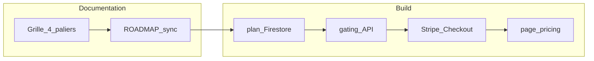

# Pricing Wroket — état et affinage

## État implémentation (inchangé)

- **Code** : pas de `plan` métier, pas de Stripe billing, pas de `/pricing` dans le dépôt aujourd’hui.
- **ROADMAP historique** : encore en Free / Pro / Team + prix indicatifs ([ROADMAP.md](ROADMAP.md) section Monétisation) — **à réconcilier** avec la grille à 4 paliers ci-dessous (mise à jour doc + messaging).

---

## Grille affinée (ta proposition)

| Palier                              | Limites / périmètre                                                                                                                                                                                                                                                                    |
| ----------------------------------- | -------------------------------------------------------------------------------------------------------------------------------------------------------------------------------------------------------------------------------------------------------------------------------------- |
| **Free**                            | 50 tâches ; **pas d’intégrations tier** (voir § *Intégrations et notifications*) — planification **in-app** uniquement ; 30 notes ; 3 projets ; jusqu’à **2 collaborateurs** invités en **lecture seule**.                                                                                                                                            |
| **1st level**                       | Tout illimité côté volume (tâches, notes, projets) **hors** intégrations tier ; jusqu’à **5 collaborateurs** lecture seule.                                                                                                                                                              |
| **Small teams (2–5 utilisateurs)**  | **Sièges facturés 2–5** + tout le volume **1st level** + **intégrations** (Google / Microsoft calendriers, futurs connecteurs, webhooks/API si roadmap) + **collaboration édition** sur projets (rôles, co-édition) + **assignation de tâches hors projet** + RBAC à figer.        |
| **Large teams (6+ utilisateurs)**   | Tout Small teams + **fonctionnalités de reporting** — périmètre **implémentable** détaillé au § suivant (pas uniquement P4 lointain).                                                                                                                                                   |

### Intégrations et notifications (décision produit)

- **Intégrations** (synchronisation **Google Calendar** / **Microsoft 365**, connecteurs tiers, webhooks, tout ce qui sort du cœur Wroket « autonome ») : **à partir du palier Small teams** (inclus ensuite dans Large). **Free** et **1st level** n’y ont **pas** accès — à refléter dans le gating (`billingPlan` / entitlements) et sur `/pricing`.
- **Référence UI** : dans l’app, l’entrée de navigation **« Intégrations »** des **Paramètres** (`frontend/src/app/settings/page.tsx`, section *Webhooks & Intégrations* + choix d’**envoi des notifications** vers Slack / Discord / Microsoft Teams / Google Chat / e-mail) matérialise ce **pack intégrations** : **masqué ou verrouillé** tant que le compte n’est pas au moins **Small teams** (côté serveur : routes webhooks + champs profil `notificationDeliveryMode` refusés sous ce palier).
- **Notifications** : **Free / 1st** — **in-app uniquement** pour le fil d’activité produit (centre de notifications dans l’app) : **pas** de miroir e-mail ni de canaux externes (Slack, Teams, etc.) depuis les paramètres. **Small teams et plus** — peuvent activer les **sorties** (webhooks + modes d’envoi) comme aujourd’hui dans le code. Les **e-mails transactionnels** (vérification de compte, reset mot de passe, facturation Stripe) restent hors périmètre « notifications produit ».

*Note : cette règle remplace la mention précédente d’un « compte calendrier externe » sur le Free ; l’ancienne ligne tableau est conservée en historique mental mais le périmètre commercial à coder est celui-ci.*

---

## Reporting — palier Large teams (implémentable avec le produit actuel)

### Socle déjà dans le code

- **Dashboard équipe** : `GET /teams/:teamId/dashboard` — `backend/src/controllers/teamController.ts` (`getTeamDashboard`) : tâches des **projets actifs** de l’équipe uniquement ; agrégats `totalTasks`, `byMember` (total, overdue), `overdue`, `dueSoon` (48 h), liste des todos + `memberMap`.
- **Dashboard perso** : `frontend/src/app/dashboard/page.tsx` — compteurs (actives, assignées, déléguées, complétées), **taux de complétion**, retards, **radar Eisenhower** (quadrants).
- **Projet** : `frontend/src/app/projects/_components/ProjectDetailView.tsx` — **% d’avancement** tâches / phases.

Données disponibles côté tâche utiles au reporting : **priorité, effort, deadline, statut, assignation, projet, phase, récurrence, créneau planifié, timestamps** (`statusChangedAt`, `updatedAt`, etc.).

### Lot V1 recommandé (valeur « Large » visible, effort maîtrisé)

1. **Synthèse équipe sur fenêtres 7 / 14 / 30 jours** : tâches **complétées** par période (via `statusChangedAt` + `completed`), **créées**, **toujours actives** ; breakdown **par projet** et **par membre** (aligné sur le scope actuel du dashboard équipe).
2. **Risques & échéances** : backlog **overdue** et **due soon** agrégé multi-projets ; tâches **sans deadline** ; optionnel : volume par **priorité / effort** (heatmap simple).
3. **Santé multi-projets** : tableau triable (projet, % complété, nb retards, **vélocité simple** = complétions / semaine sur 4 dernières semaines) — sans jargon « sprint » au début.
4. **Exports « steering »** : CSV (puis PDF si besoin) **au périmètre équipe** (mêmes colonnes que l’export tâches existant + projet, phase, assigné) — utile managers / COMEX.

### Lot V2 (après traction ou si scope Large élargi)

- **Burndown** par période ou par « release » (nécessite modèle de **scope figé** ou intégration phases comme jalons de livraison).
- **Charge vs calendrier** (agrégation créneaux / busy + charge tâches — complexité moyenne).
- **Rapports planifiés** : si un jour **email** de récap — aujourd’hui le plan notif impose **in-app uniquement** ; un digest email serait une **exception** explicite à trancher (opt-in, palier, conformité).

### À ne pas vendre comme « reporting inclus » sans chantier dédié

- **Temps passé / ROI** (pas de données sans **time tracking**).
- **OKR / analytics prédictifs** (hors modèle actuel).

---

## Tarifs : attractif sans « cheap » (recommandation)

**Principes**

- **Chiffres ronds en EUR TTC affiché** (ou HT + TVA claire pour pro) : évite le côté « appli à 4,99 € » ; renforce la perception **outil de travail**.
- **Remise annuelle ~15–20 %** (équivalent « 2 mois offerts ») : standard SaaS ; augmente le LTV sans casser le mensuel.
- **Écart clair solo → équipe** : le palier équipe doit coûter **nettement plus** qu’un 1st level seul, sinon le solo « illimité » cannibalise Small teams.
- **Plancher Small teams** : facturer au moins **2 sièges** dès l’entrée (sinon confusion avec solo + invités read-only).
- **Facturation équipe** : **prix unique par siège** (mensuel ou annuel au **siège**), **pas** de forfait annuel global « équipe » — simplifie Stripe (`quantity` × prix unitaire) et le discours client.

**Fourchettes indicatives (France / micro-PMO, à valider marché)**

| Palier          | Public cible            | Mensuel (indicatif)                             | Annuel (indicatif, ~17 % de remise)                                                        |
| --------------- | ----------------------- | ----------------------------------------------- | ------------------------------------------------------------------------------------------ |
| **Free**        | Acquisition, solo léger | 0 €                                             | —                                                                                          |
| **1st level**   | Solo power-user         | **6,99 € / mois**                               | **~69 € / an** (~17 % vs 12 × mensuel ; ancien repère roadmap 89 € / an **non repris** ici) |
| **Small teams** | 2–5 sièges, collab      | **8,99 € / siège / mois**, **minimum 2 sièges** | **~89 € / siège / an**                                                                     |
| **Large teams** | 6+ sièges + reporting   | **12,99 € / siège / mois**                      | **~109,99 € / siège / an**                                                                 |

**Packaging (validé dans ce plan)**

- **Un prix catalogue par siège** par palier (Small vs Large : **deux** tarifs siège différents, seuil **6** utilisateurs payants pour passer en Large — à caler côté produit + Stripe).
- **Annuel** : remise au **siège** (même logique que le mensuel × 12), **sans** forfait plat « équipe / an ».
- **Stripe** : typiquement **jusqu’à 6 Price IDs** (solo mensuel + annuel ; siège Small mensuel + annuel ; siège Large mensuel + annuel), tous en **unit_amount par siège** (ou par utilisateur solo) — pas de ligne « forfait équipe ».

**Pourquoi ça sonne « solide »**

- Le **solo** à **6,99 € / mois** reste **au-dessus du segment « 3 €/mois »** (TickTick) et **proche de Todoist Pro** en € — crédible sans se positionner premium type Motion.
- L’**équipe au siège** (pas un vague « pack ») aligne le prix sur la **valeur créée** (collaboration réelle) et prépare Stripe `quantity`.
- **Large** plus cher **au siège** que Small : le **reporting** est porté par le **même modèle** (pas un forfait opaque) ; la **marche +44 %** environ (8,99 → 12,99 €) se lit clairement sur `/pricing`.

**Point d’attention (seuil 5 → 6)**

- Au **6e** membre payant, le **prix par siège** augmente (Large) : prévoir message produit (« à partir de 6 collaborateurs : palier reporting + tarif siège Large ») pour éviter la surprise **sans** forfait équipe, la facture reste **N × prix unitaire du palier**.

**À afficher sur la page pricing** (crédibilité)

- « Facturation sécurisée », logos **Stripe** ; mention **RGPD** / hébergement **UE** si vrai.
- **Comparez** (sans dénigrer) : une ligne du type « moins cher qu’un déjeuner d’équipe / mois » pour 2–3 sièges — utile si le montant absolu fait peur.

*Ces montants sont des **hypothèses de cadrage** ; vérifier les grilles officielles avant gel des prix publics.*

### Benchmark « concurrents » (ordre de grandeur, souvent en USD)

Les éditeurs affichent en général des prix en **$** ; conversion **EUR** indicative (~0,90–0,95 $ → 1 € selon période). Les montants **changent** (Notion 2025, Todoist déc. 2025, etc.) — toujours se référer au **site officiel** du concurrent.

| Produit                                              | Segment                                                                                                                                      | Repère public (à vérifier)                                                                                              | Lecture vs Wroket (**1st 6,99 €** ; **Small 8,99 € / siège** ; **Large 12,99 € / siège**)                                                                                                              |
| ---------------------------------------------------- | -------------------------------------------------------------------------------------------------------------------------------------------- | ----------------------------------------------------------------------------------------------------------------------- | ------------------------------------------------------------------------------------------------------------------------------------------------------------------------------------------------------ |
| **TickTick** Premium                                 | Liste + calendrier solo, peu cher                                                                                                            | ~**36 $ / an** (ordre **3 $ / mois** équivalent annuel)                                                                 | Wroket **solo** reste **nettement au-dessus** : OK si tu vends PMO/agenda pro, pas « remplaçant TickTick au même prix ».                                                                                |
| **Todoist** Pro                                      | Tâches solo                                                                                                                                  | **~7 $ / mois** ou **~60 $ / an** (mise à jour fin 2025)                                                                | **6,99 € / mois** solo : **très proche** du Pro Todoist en € (légèrement en dessous du $7 converti — acquisition agressive mais crédible).                                                               |
| **Todoist** Business                                 | Petites équipes tâches                                                                                                                       | **~10 $ / siège / mois** (mensuel) ; **~8 $** en annuel (mise à jour fin 2025)                                          | **8,99 € / siège** Small : **sous** Todoist Business au siège en € — argument **prix** fort ; vérifier que la marge couvre support + infra.                                                            |
| **Notion** Plus / Business                           | Docs + wiki + tâches léger                                                                                                                   | **~10 $ / membre / mois** (Plus) ; **~20 $** (Business)                                                                 | Solo **sous** Notion Plus en € ; sièges **sous** Notion Business — large marge de manœuvre marketing **« moins cher que Notion »** si le produit tient la comparaison sur le scope.                      |
| **Asana** Starter                                    | PM classique                                                                                                                                 | **~11–13,5 $ / siège / mois** selon mensuel / annuel ; souvent **minimum 2 sièges** cité pour l’entrée                  | Small et Large **sous Asana** au siège : cohérent avec **PMO accessible**.                                                                                                                             |
| **Motion**                                           | Calendrier + tâches + IA                                                                                                                     | **~19 $+ / siège / mois** (annuel ; variantes Business plus haut)                                                       | **Référence haut de gamme** : **12,99 € / siège** Large reste **bien sous Motion** si tu ne vends pas la même promesse IA.                                                                             |
| **Microsoft To Do + Planner** (+ calendrier Outlook) | Souvent **inclus dans Microsoft 365** (Business Standard, E3/E5, etc.) — coût perçu **nul** ou **marginal** pour l’utilisateur déjà licencié | Pas de grille « 9 $/mois » publique comparable : le **référentiel prix** est le **contrat M365 / siège** chez le client | Voir encadré **substitut vs complément** ci-dessous.                                                                                                                                                   |

**Microsoft 365 — substitut vs complément (message pricing / vente)**

- **Substitut (concurrence réelle)** : pour une équipe **100 % M365** satisfaite de To Do + Planner + Outlook seuls, Wroket doit gagner sur **l’expérience** (agenda + tâches + projets + Google **et** Microsoft dans un seul flux, rappels, early bird, etc.) — le **prix Wroket s’ajoute** au budget IT ; il faut un **argument valeur** clair, pas « moins cher que Gratuit ».
- **Complément (positionnement souvent plus sain)** : Wroket comme **couche productivité** au-dessus du calendrier Exchange / Outlook et des listes basiques : réservation de créneaux, conflits, Meet/Teams liés aux tâches, vues unifiées, **hors** complexité SharePoint / Planner avancé pour certaines populations (PMO léger, freelances, équipes Google + Microsoft mélangées).
- **Pricing** : ne pas aligner le solo sur « 0 € » To Do ; rester sur la **grille Todoist / Notion** (outil dédié). Sur `/pricing`, une **FAQ** du type « J’ai déjà Microsoft 365 — pourquoi payer Wroket ? » avec la réponse **complément** (et un mot sur **substitut** si cible power-user).

**Synthèse positionnement**

- **Solo (1st level)** : **très proche de Todoist Pro** en €, **sous Notion Plus** — lisible comme **« sérieux mais pas Motion »** ni **« TickTick »** ; le prix solo bas renforce l’**acquisition**.
- **Small teams** : **sous Todoist Business / Notion Business / Asana** au siège — **très attractif** ; surveiller **marge** et coût support à volume.
- **Large + reporting** : **marche nette** vs Small (8,99 → 12,99 € / siège) ; **loin de Notion Business (~20 $)** et de **Motion** — argument prix sur le **reporting**.
- **Microsoft 365** : assumer que **To Do / Planner** est un **concurrent à coût nul marginal** pour une partie du marché ; positionner Wroket en **complément** par défaut et **substitut** pour les profils prêts à payer pour une **expérience unifiée** (et dual Google/Outlook).

---

## Avis / critique produit

**Points forts**

- **Free généreux** (50 tâches, 30 notes, 3 projets) : meilleur pour l’acquisition que l’ancien plafond « 25 tâches » ; crédible pour un vrai essai PMO léger.
- **Séparation claire volume (1st level) vs travail d’équipe (small/large)** : bonne logique économique (solo paye pour l’illimité ; équipes payent pour collaboration + sièges).
- **Collaborateurs read-only** comme levier de monétisation : simple à expliquer marketing ; aligné avec une future bannière « invitez en édition → upgrade ».

**À clarifier avant spec technique**

1. **Agenda / intégrations (Free & 1st)** — **Tranché** : pas d’intégration tier avant **Small teams** ; le Free n’a donc **pas** de sync Google/Microsoft. À mettre en cohérence avec l’UI (masquer ou griser « Connecter Google/Microsoft » jusqu’à upgrade équipe).
2. **Redondance Small teams / 1st level**
  Si 1st level = déjà projets + notes illimités (sans intégrations tier), la ligne « + projets illimités » pour Small teams n’apporte rien. Mieux vaut formuler Small teams comme : **« sièges 2–10 + intégrations + collaboration complète (édition projet, rôles, assignation y compris hors projet) »** sans répéter l’illimité volume.
3. **Large teams = « tout illimité »**
  Si 1st level est déjà « tout illimité » pour un utilisateur solo, « tout illimité » pour Large teams ne distingue que le **reporting** + probablement **plus de sièges / SSO / admin**. Expliciter : sièges 11+ ? domaine ? SLA ? sinon le palier est difficile à vendre.
4. **Collaborateurs read-only vs membres d’équipe**
  Vérifier cohérence avec le modèle actuel (équipes Wroket, rôles projet, assignation). Faut-il un rôle `viewer` sur projet + plafond par palier, ou un type d’invitation distinct ?
5. **Stripe**
  Quatre paliers publics mais **deux payants « équipe »** (small / large) suggèrent : produit **solo (1st)** + produit **team** avec **quantity** sièges (2–10 vs 11+) ou deux SKU ; Free sans Stripe.

**Recommandation synthétique**

- Conserver ta **structure à 4 niveaux** ; ajuster le **wording Small teams** pour enlever la redondance « projets illimités ».
- Trancher **intégrations** : **Small teams minimum** ; **notifs in-app uniquement** (hors emails transactionnels / billing).
- **MVP Stripe** : ship **Free + 1st level** d’abord, puis **Small teams** (quantity), puis **Large** (même produit avec min quantity 11 ou SKU séparé + reporting flag) pour limiter la surface de bugs billing.

---

## Ordre d’implémentation (inchangé dans l’esprit)

1. Spec opérationnelle (grille + définitions) + mise à jour **ROADMAP** / page pricing copy.
2. Modèle `plan` + gating serveur + UX upgrade.
3. Stripe (Checkout + webhooks + portail).
4. `/pricing` public.

---

## Synthèse décision (rappel)

| Choix                                | Intérêt                          | Risque                                                                          |
| ------------------------------------ | -------------------------------- | ------------------------------------------------------------------------------- |
| 4 paliers avec solo « illimité » tôt | Upsell clair vers équipes        | Trop proche de « tout illimité » : bien séparer **collab / sièges / reporting** |
| Early bird (comptes existants)       | Évite choc au passage des quotas | Moins de conversion immédiate sur Free                                          |

**Verdict sur ta grille** : **direction solide** ; affiner **Small teams** (retirer redondance), **Large teams** (périmètre reporting + sièges), et **intégrations / notifs** (règles ci-dessus) avant d’encoder le gating.

---

## 1 — Réduire le risque « tout illimité » / bien séparer collab, sièges, reporting

**Principe** : le **1st level** ne doit pas être perçu comme « déjà l’offre équipe sans payer ». Séparer **trois axes** distincts dans la doc, la page pricing et le code de gating :

| Axe                                          | Solo (1st level)                                                                                                                                                                   | Small teams                                                                                 | Large teams                                                                               |
| -------------------------------------------- | ---------------------------------------------------------------------------------------------------------------------------------------------------------------------------------- | ------------------------------------------------------------------------------------------- | ----------------------------------------------------------------------------------------- |
| **Volume** (tâches, notes, projets)          | Illimité                                                                                                                                                                           | Idem (héritage)                                                                             | Idem                                                                                      |
| **Intégrations**                             | **Aucune** (pas Google/Microsoft sync, pas webhooks)                                                                                                                               | **Oui** (calendriers + futurs connecteurs)                                                  | Idem                                                                                      |
| **Collab** (qui peut faire quoi)             | Invités **read-only** plafonnés (ex. 5) ; **pas** d’édition multi-utilisateur sur le même projet ; **pas** d’assignation « équipe » hors projet si tu la réserves au palier équipe | Édition projet + rôles + assignation hors projet + plafonds invités plus hauts ou illimités | Idem + éventuellement rôles avancés / politiques                                          |
| **Sièges / facturation**                     | **1 utilisateur payant** (abonnement solo)                                                                                                                                         | **2–10 sièges** (Stripe quantity ou plan dédié)                                             | **11+** (ou seuil choisi) + SKU / prix différent                                          |
| **Reporting**                                | **Absent** (ou métriques minimales type « ma semaine » gratuites)                                                                                                                  | Tableaux d’équipe **légers** (optionnel — sinon tout dans Large pour simplifier)            | **Module reporting** : exports, vues charge, burndown, etc. (liste figée marketing + dev) |

**Leviers concrets**

1. **Matrice « une ligne = une feature »** : pour chaque capacité (assignation hors projet, rôle `editor` sur projet, webhook, import massif, etc.), une case **Free / 1st / Small / Large** — évite le flou « tout illimité ».
2. **Naming** : éviter deux colonnes qui répètent « illimité » ; par ex. **« Solo Pro »** vs **« Équipe »** pour que le lecteur associe sièges + collab au palier équipe uniquement.
3. **Garde-fous produit** : sur **1st level**, bloquer toute action qui crée implicitement une **workspace multi-payante** (ex. second membre avec droit d’édition sur un projet partagé) — message explicite « passez à Équipe ».
4. **Reporting uniquement Large** (ou pack add-on) : crée un **écart de prix visible** et un story telling simple.

---

## 2 — Comptes existants : les considérer comme Small team ?

**Recommandation : non**, par défaut **ne pas** mapper automatiquement les comptes existants sur **Small teams**.

**Raisons**

- **Small team** = intention commerciale **multi-sièges** + (souvent) facturation Stripe au niveau workspace — impliquerait des comptes solo sans moyen de paiement d’équipe, ou des orgs à 1 personne « étiquetées équipe », ou des migrations Stripe complexes.
- **Rétention** : le risque principal au go-live est le **choc de quotas** (Free), pas l’absence de palier équipe.
- **Simplicité juridique / billing** : tant qu’ils n’ont pas souscrit un produit « équipe », ils restent des **comptes solo** côté Stripe.

**Politique recommandée (à trancher en une règle)**

| Option                                           | Description                                                                                                                                                                                                                         |
| ------------------------------------------------ | ----------------------------------------------------------------------------------------------------------------------------------------------------------------------------------------------------------------------------------- |
| **A — Early bird / équivalent 1st level**        | Tous les comptes **créés avant date T** : entitlements **alignés sur 1st level** (volume + règles solo), **sans** souscription Stripe, jusqu’à date T+N ou à vie (décision produit). Pas de small team implicite.                   |
| **B — Early bird avec exception vraies équipes** | Si un **workspace** a déjà **≥ 2 membres avec droit d’édition** (métrique produit), proposer **migration guidée** vers Small team (trial 30j puis paiement) au lieu d’un downgrade brutal — reste **opt-in**, pas auto-facturation. |
| **C — Small team auto**                          | À éviter sauf si vous assumez **crédit offert** ou **0 € jusqu’à date** avec équipe Stripe créée automatiquement (lourd opérationnellement).                                                                                        |

**Verdict** : partir sur **A** (statut **early bird**, ou **B** si vous avez déjà beaucoup de vrais petits groupes en prod) ; **Small team** reste un **achat explicite** (Checkout + sièges), pas un statut par défaut des anciens comptes.